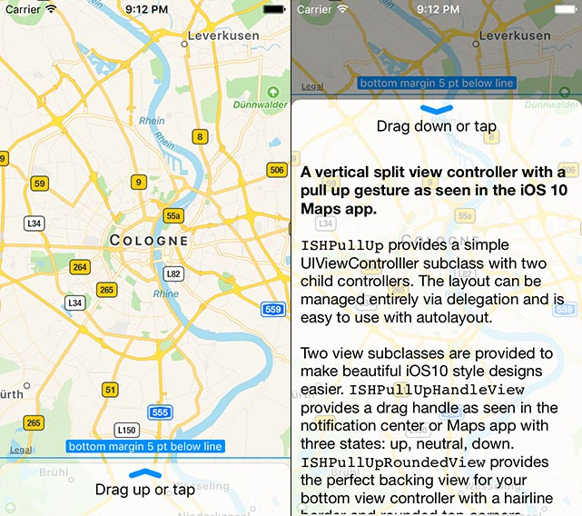
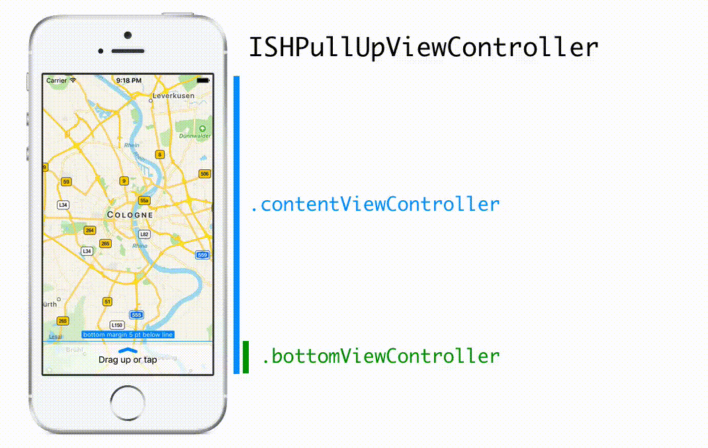

#  ISHPullUp

[](http://travis-ci.org/iosphere/ISHPullUp)

**A vertical split view controller with a pull up gesture as seen in the iOS 10 
Maps app.**



ISHPullUp provides a simple UIViewControlller subclass with two child controllers. 
The layout can be managed entirely via delegation and is easy to use with autolayout.

Two view subclasses are provided to make beautiful iOS10 style designs easier. 
ISHPullUpHandleView provides a drag handle as seen in the notification center or Maps app 
with three states: up, neutral, down. ISHPullUpRoundedView provides the perfect backing 
view for your bottom view controller with a hairline border and rounded top corners.

## Basic usage



To use the framework create an instance of `ISHPullUpViewController` and set the 
`contentViewController` and `bottomViewController` properties to your own view controller 
instances. That's it, everything else is optional. 

Implement the appropriate delegates to fine-tune the behaviour. While all delegates are 
optional, the methods of all delegates themselves are mandatory.

You can customize a lot more via the `ISHPullUpViewController` properties:

* When and if the bottom should snap to the collapsed and expanded positions
* At what threshold the content should be dimmed using which color
* If the bottom view controller should be shifted or resized

### Controlling the height using the `sizingDelegate`

The height of the `bottomViewController` is controlled by the `sizingDelegate`. All heights are cached and updated regularly. You can use auto layout to calculate minimum and maximum heights (e.g. via `systemLayoutSizeFitting(UILayoutFittingCompressedSize)`).

You can customize:

* The minimum height (collapsed): `...minimumHeightForBottomViewController...`
* The maximum height (expanded): `...maximumHeightForBottomViewController...`
* Intermediate snap positions: `...targetHeightForBottomViewController...`

As an example, the minimum height is determined by the following delegate callback:
```swift
// Swift
func pullUpViewController(_ pullUpViewController: ISHPullUpViewController, minimumHeightForBottomViewController bottomVC: UIViewController) -> CGFloat 
```
```objective-c
// ObjC
- (CGFloat)pullUpViewController:(ISHPullUpViewController *)pullUpViewController minimumHeightForBottomViewController:(UIViewController *)bottomVC;
```

The sizing delegate also provides a callback to adjust the layout of the `bottomViewController`: `...updateEdgeInsets:forBottomViewController:`.

### Adjusting the layout of the `contentViewController` using the `contentDelegate`

The view of the `contentViewController` fills the entire view and is partly overlaid by
the view of the `bottomViewController`. In addition the area covered by the bottom view can change. To adjust your layout accordingly you may set the `contentDelegate`. Additionally, we suggest that your content view controller uses a dedicated view as the first child to its own rot view that provides layout margins for the rest of the layout. The typical implementation of the content delegate would then look like this:  

```swift
// Swift
func pullUpViewController(_ vc: ISHPullUpViewController, update edgeInsets: UIEdgeInsets, forContentViewController _: UIViewController) {
	layoutView.layoutMargins = edgeInsets
	// call layoutIfNeeded right away to participate in animations
	// this method may be called from within animation blocks
	layoutView.layoutIfNeeded()
}
```
```objective-c
// ObjC
- (void)pullUpViewController:(ISHPullUpViewController *)pullUpViewController updateEdgeInsets:(UIEdgeInsets)edgeInsets forContentViewController:(UIViewController *)contentVC {
	self.layoutView.layoutMargins = edgeInsets;
	// call layoutIfNeeded right away to participate in animations
	// this method may be called from within animation blocks
	[self.layoutView layoutIfNeeded];
}
```

### Reacting to changes in state

The `ISHPullUpViewController` has four states: collapsed, dragging, intermediate, expanded.

You can react to state changes (e.g. to update the state of a `ISHPullUpHandleView`) by 
setting the `stateDelegate` and implementing its only method.
 
## General info

The framework is written in **Objective-C** to allow easy integration into any iOS project 
and has fully documented headers. All classes are annotated for easy integration into 
*Swift* code bases.

The sample app is written in **Swift 3** and thus requires *Xcode 8* to compile.

The framework and sample app have a **Deployment Target** of **iOS8**.

## Integration into your project

### Dynamically-Linked Framework

Add the project file `ISHPullUp.xcodeproj` as a subproject of your app. 
Then add the framework `ISHPullUp.framework` to the app's embedded binaries 
(on the *General* tab of your app target's settings). On the *Build Phases* tab, 
verify that the framework has also been added to the *Link Binary with
Libraries* phase, and that a new *Embed Frameworks* phase has been created.

The framework can be used as a module, so you can use `@import ISHPullUp;`
to import all public headers.  Further reading on Modules: 
[Clang Documentation](http://clang.llvm.org/docs/Modules.html)

### Include files directly

Currently the project relies on 3 implementation files and their headers. 
You can include them directly into your project:

* `ISHPullUp/ISHPullUpHandleView.h/m`
* `ISHPullUp/ISHPullUpRoundedView.h/m`
* `ISHPullUp/ISHPullUpViewController.h/m`

### CocoaPods

You can use CocoaPods to install ISHPullUp as a static library:

```ruby
target 'MyApp' do
  pod 'ISHPullUp'
end
```

See the [official website](https://cocoapods.org/#get_started) to get started with
CocoaPods.

ISHPullUp can also be installed as a framework through CocoaPods:

```ruby
target 'MyApp' do
  use_frameworks!
  pod 'ISHPullUp'
end
```

It requires at least iOS 8 at runtime and can be imported as a module, see
[Dynamically-Linked Framework](#dynamically-linked-framework).


## TODO

* [ ] Add modal presentation mode for a bottom view controller
